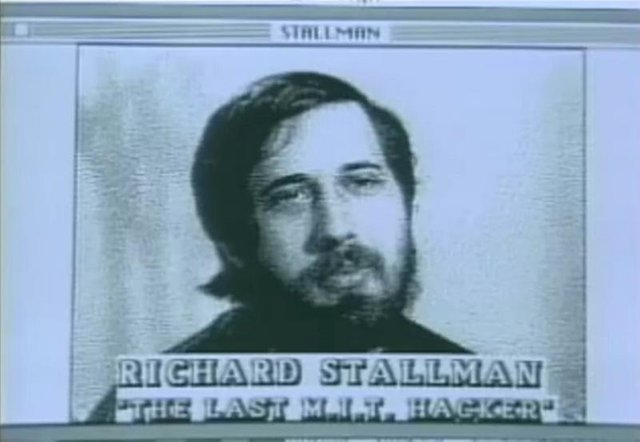
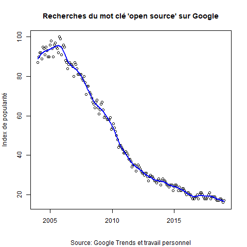

# Introduction

## Qui parmi vous utilise des logiciels open-source ou libres ?

- Firefox
- R
- OpenOffice / LibreOffice
- VLC 
- GIMP
- \LaTeX    

- Linux (GNU/Linux)
- Git/Github  

## Problématique

### Le logiciel libre et/ou open-source est-il encore d'actualité aujourd'hui ?

# Définitions

## Logiciel libre

- 1983: lancement officiel de **GNU**   
\
- **Richard Stallman** (1953- )   
\

```{r, out.width="200px", fig.align = "center", echo = FALSE}
library(knitr)
include_graphics("./Stallman2.jpg")
```

## Les quatre libertés (Stallman 2002: 43)

- liberté d'utiliser le logiciel à n'importe quelle fin    
\
- liberté d'étudier le logiciel et de l'adapter à ses besoins    
\
- liberté de redistribuer le logiciel    
\
- liberté d'améliorer le logiciel et de partager les améliorations

## Open-source

- Terme développé Bruce Perence et Eric Raymond en 1998 (Deek et McHugh 2008:297)    
\
- Un début de **démocratisation** liée au développement d'internet   
\
- Définition de l'**OSI** basée sur 10 critères (Deek et McHugh 2008:246)   
\
- Critique de Richard Stallman (2002: 57-62)

```{r, out.width="130px", fig.align = "center", echo = FALSE}

```

## Copyleft et licences

- Réaction au copyright (Stallman 2002: 91)   
\
- Toutes les versions améliorées ou modifiées du programme **doivent être libres également** (ibid.)    
\
- Licence **GNU GPL**   
\
- Exemple de **X Window System** (Stallman 2002: 22)

```{r, out.width="300px", fig.align = "center", echo = FALSE}
include_graphics("https://upload.wikimedia.org/wikipedia/commons/thumb/9/93/GPLv3_Logo.svg/1200px-GPLv3_Logo.svg.png")
```

---

```{r, out.width="800px", fig.align = "center", echo = FALSE}
include_graphics("./Linux.png")
```

# Un âge d'or... ?

## Les débuts à MIT

```{r, out.width="700px", fig.align = "center", echo = FALSE}

```

## Les débuts à MIT

- MIT AI Lab - PDP-11 (Stallman 2002: 17)      
\
- VAX/68020 : départ de Stallman    
\
- 1983: début du projet **GNU** (Gnu's Not Unix) et protocole TCP-IP devient une norme    
\
- 1985: **Free Software Foundation**

```{r, out.width="250px", fig.align = "center", echo = FALSE}

```

## Internet comme catalyseur: GNU, GNU/Linux et les browsers

```{r, out.width="500px", fig.align = "center", echo = FALSE}
include_graphics("https://pbs.twimg.com/media/CNTUaPxXAAAO69Q.png")
```

## Internet comme catalyseur: GNU, GNU/Linux et les browsers

- Manque d'ergonomie au début   
\
- L'email et le protocole de transfert de ficher (FTP) facilite les échanges (Deek et McHugh 2008: 119)  
\
- 1992: GNU/Linux, premier système d'exploitation entièrement libre   
\
- Dans la foulée, les premiers browsers: Mosaic, Netscape, Firefox (Deek et McHugh 2008: 37-48)

# ...Suivi d'un déclin ?

## Un déclin apparent

```{r, out.width="500px", fig.align = "center", echo = FALSE}

```

## Mais trompeur

```{r, out.width="700px", fig.align = "center", echo = FALSE}

```

## En réalité

- Banalisation dans les usages personnels et commerciaux       
\
- Licences sur Github mais aussi dans les entreprises (Nevo et Chengalur-Smith 2017)

# Bibliographie

## Ouvrages et lien vers mon code

- Deek, F. P. and McHugh, J. A. (2008). *Open Source. Technology and Policy*. Cambridge: Cambridge University Press.
- Gay, J., ed. (2002). *Free Software Free Society. Selected essays of Richard M. Stallman*. Boston: GNU Press.
- Nevo, S. and Chengalur-Smith, I. (2017). ‘Examining organizations’ continued use of open source technologies’. *Information Technology and People*, vol. 30, no. 1, pp 24-46.
- Söderberg, J. (2008). *Hacking Capitalism. The Free and Open Source Software Movement*. New York: Routledge.
- https://github.com/julesbeley/Presentation

## Article récent du *Monde* sur VLC

```{r, out.width="700px", fig.align = "center", echo = FALSE}

```

[Lien](https://www.lemonde.fr/pixels/article/2019/01/28/l-irresistible-ascension-du-lecteur-video-vlc-une-revolution-francaise_5415762_4408996.html)