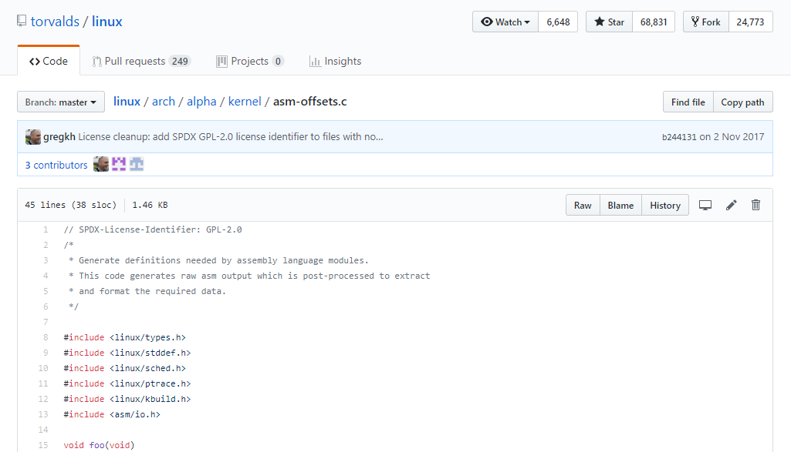
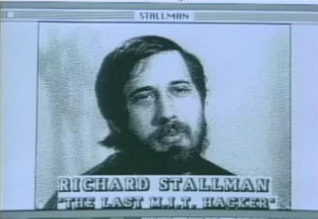
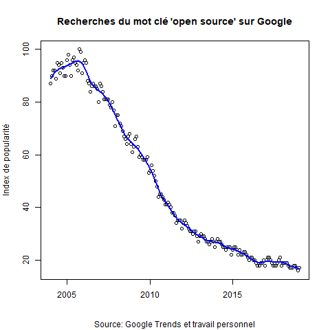

# Introduction

## Qui parmi vous utilise des logiciels open-source ou libres ?

- Firefox
- R
- OpenOffice / LibreOffice
- VLC 
- GIMP
- \LaTeX    
\
- Linux (GNU/Linux)
- Git/Github

# Définitions
## Logiciel libre

- 1983: lancement officiel de GNU   
\
- Richard Stallman (1953-)   
\

### Les quatre libertés (Stallman 2002: 43)
- 0: liberté d'utiliser le logiciel à n'importe quelle fin
- 1: liberté d'étudier le logiciel et de l'adapter à ses besoins
- 2: liberté de redistribuer le logiciel
- 3: liberté d'améliorer le logiciel et de partager les améliorations

## Open-source

- Terme développé Bruce Perence et Eric Raymond en 1998 (Deek et McHugh 2008:297)    
\
- Une forme de démocratisation liée au développement d'internet   
\
- Définition de l'OSI basée sur 10 critères (Deek et McHugh 2008:246)   
\
- Critique de Richard Stallman (Gay 2002: 57-62)

## Copyleft et licences

- Réaction au copyright (Stallman 2002: 91)   
\
- Toutes les versions améliorées ou modifiées du programme doivent être libres également (ibid.)    
\
- Licence GNU GPL   
\
- Exemple de X Window System (Stallman 2002: 22)

***

# Un âge d'or... ?

## D'abord, une question...
### À votre avis, les premiers logiciels étaient-ils propriétaires ou libres ?

## Les débuts à MIT

***
## Les débuts à MIT

- MIT AI Lab - PDP-11 (Stallman 2002: 17)      
\
- VAX/68020 : départ de Stallman    
\
- 1983: début du projet GNU (Gnu's Not Unix) et protocole TCP-IP devient une norme    
\
- 1985: Free Software Foundation

## Internet comme catalyseur: GNU, GNU/Linux et les browsers

## Internet comme catalyseur: GNU, GNU/Linux et les browsers

- Manque d'ergonomie au début   
\
- L'email et le protocole de transfert de ficher (FTP) facilite les échanges (Deek et McHugh 2008: 119)  
\
- 1992: GNU/Linux, premier systeme d'exploitation entièrement libre   
\
- Dans la foulée, les premiers browsers: Mosaic, Netscape, Firefox (Deek et McHugh 2008: 37-48)

# ...Suivi d'un déclin ?
***

# Conclusion
# Bibliographie
## Ouvrages et lien vers mon code
- Söderberg, J. (2008). \textit{Hacking Capitalism. The Free and Open Source Software Movement}. New York: Routledge. 
- Weber, S. (2004). \textit{The Success of Open Source}. Cambridge, MA: Harvard University Press.
- Deek, F. P. and McHugh, J. A. (2008). \textit{Open Source. Technology and Policy}. Cambridge: Cambridge University Press.
- Gay, J. (2002). \textit{Free Software Free Society. Selected essays of Richard M. Stallman}. Boston: GNU Press.
- <https://github.com/julesbeley/Presentation>
